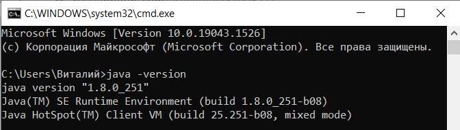
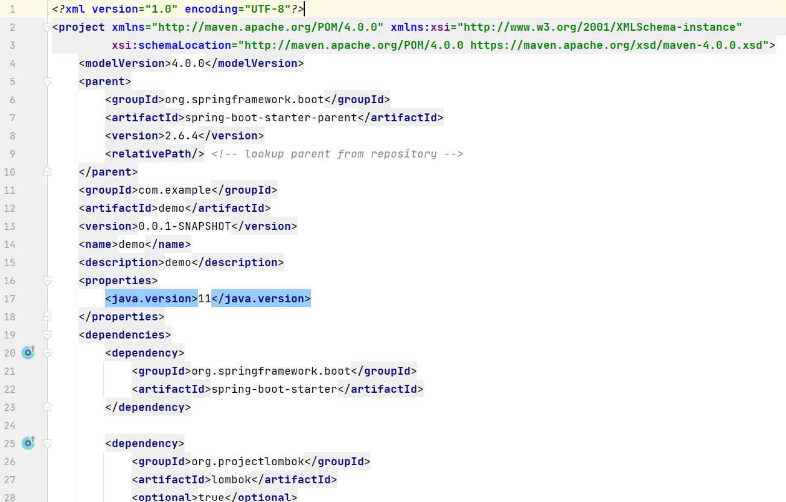
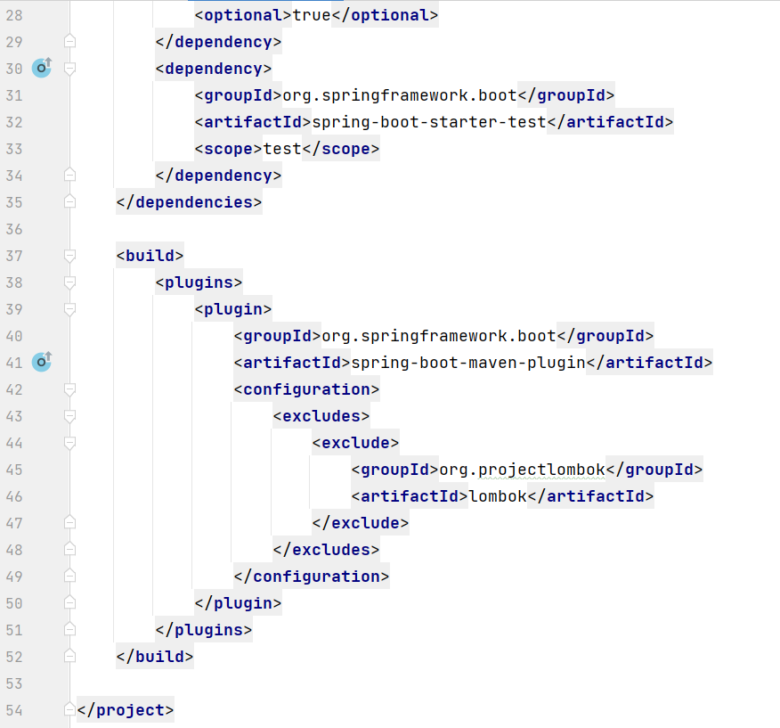
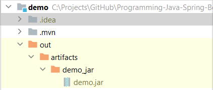
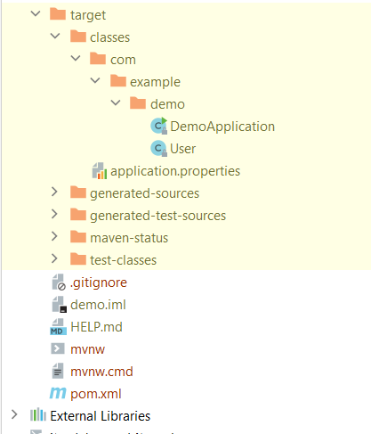
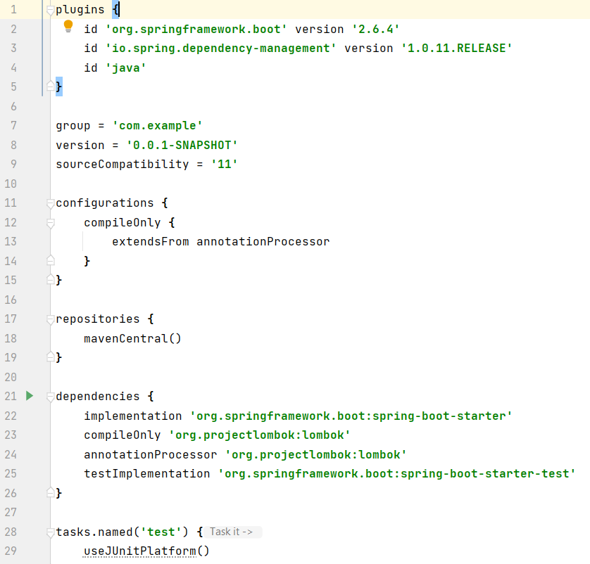
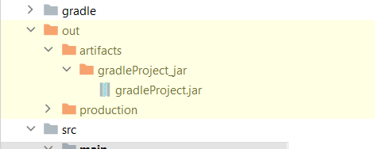
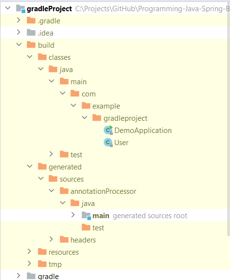

# Задание
- JRE и JDK
1) Установить openjdk.
2) Проверить работу из консоли, выполнив java --version.
3) Приложить скриншот выполнения

- Maven/gradle
Собрать jar-файл, добавив какую-нибудь зависимость и использовав её в коде. Как для maven, так и для gradle.
Приложить скриншоты сборки и работающего приложения

P.S. не совсем корректно описал maven install (совсем не корректно)

install -- adds all artifact (dependencies) specified in pom, to the local repository (from remote sources) (добавляет все зависимости, которые вы описали в pom.xml, к вашему проекту)

 
- Git
1) Создать проект на GitHub
2) Склонировать проект
3) В отдельной ветке добавить новую фичу (добавить новый файл, например)
4) Слить с основной веткой
5) Залить изменения в удаленный репозитори

# JRE и JDK
Скриншот результата выполнения команды `java -version`:

# Maven/gradle
Создадим класс `User` и напишем код, требующий ввести имя пользователя с консоли и выводящий приветствие.

Результат сборки на основе Maven

Файл pom.xml:

.jar файл:

Папка target со скомпилированным проектом:

Результат сборки на основе Gradle

Файл build.gradle:

.jar файл:

Папка build со скомпилированным проектом:

# Git
В ветке `Branch-to-merge` был файл `test.txt`, а затем её слили с текущей.
