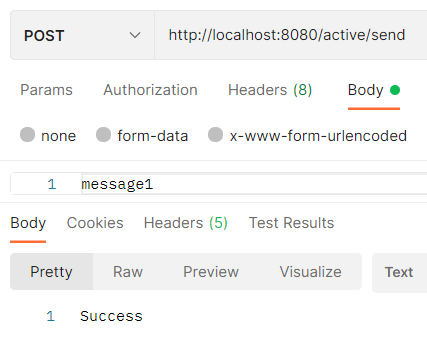
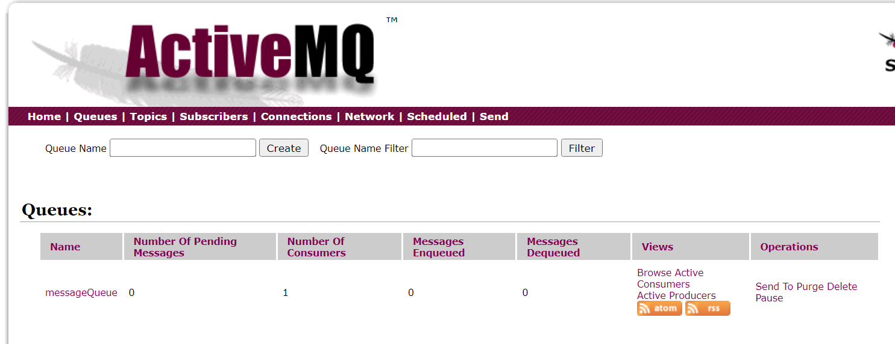
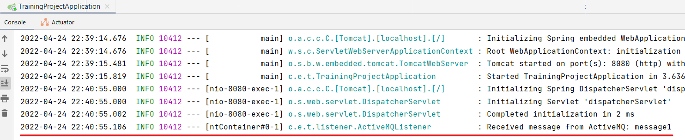
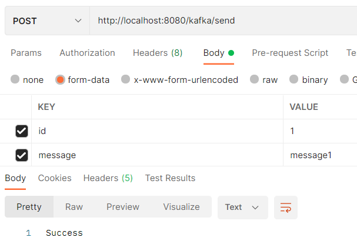
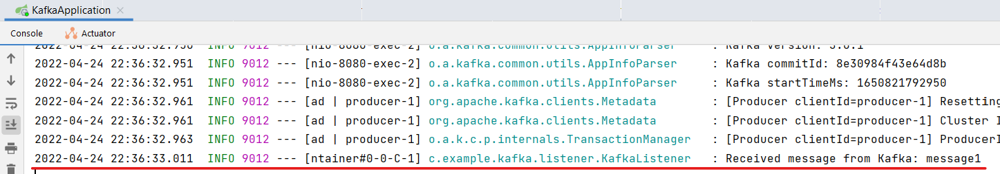

# Homework 12
1) Установить ActiveMQ. Написать два приложения: одно отправляет текст в очередь, другое читает его и выводит в консоль.
2) То же самое для Kafka.

## Решение
Приложение с ActiveMQ - `training-project`.
Приложение с Kafka - `kafka`.

### ActiveMQ
Запускаем ActiveMQ. Отправляем сообщение через `JmsTemplate`:

Проверяем, что указанный топик `messageQueue` создался:

Вывод в лог:

### Kafka
Запускаем ZooKeeper. Запускаем Kafka. Отправляем сообщение с `id="1"` и `message="message1"` через `KafkaTemplate`:

Вывод в лог:

