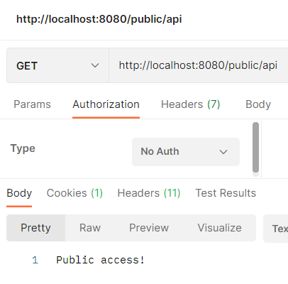
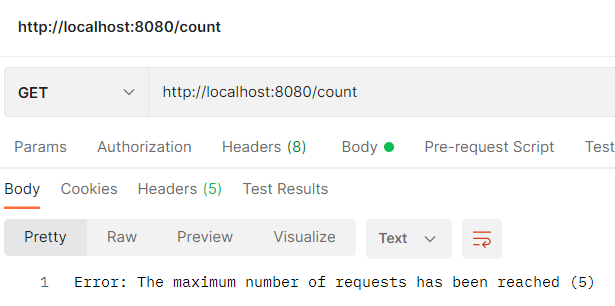
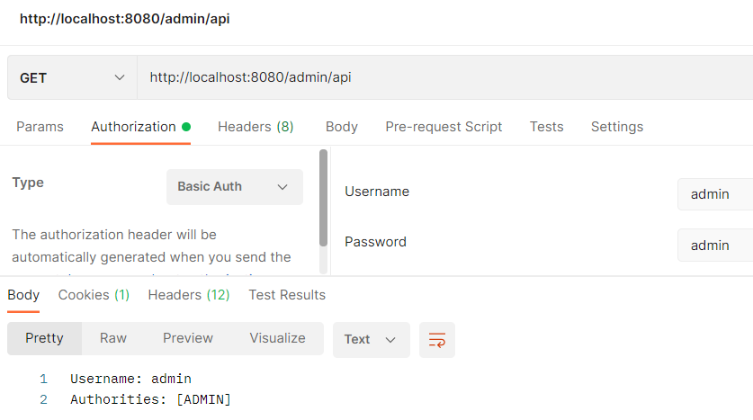
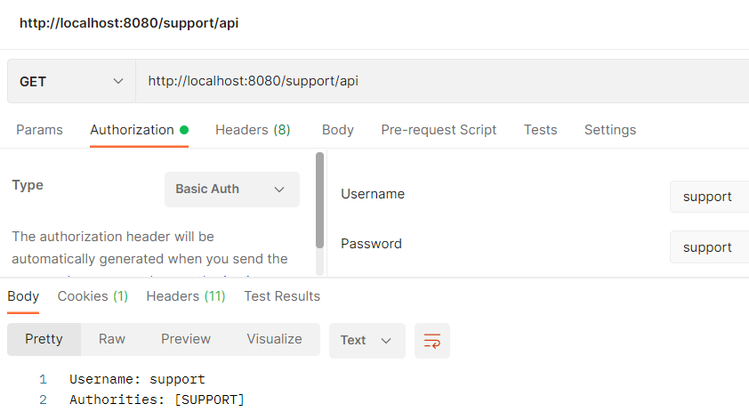

# Homework-10
Реализовать приложение с разделением прав доступа

АПИ:
* public/api - доступ разрешен для всех
* admin/api - доступ разрешен для пользователей с ролью admin
* support/api - доступ разрешен для пользователей с ролью support

Все приватные АПИ должны возвращать имя и роль пользователя

Хранение пользователей в памяти приложения (использование InMemoryUserDetailsManager)

Для хеширования паролей использовать BCryptPasswordEncoder

Basic аутентификация
## Решение
Целевое приложение - `security`.

Результаты:

* `public/api`:

* `admin/api` - попытка обращения без авторизации:

* `admin/api` - с авторизацией:

* `support/api` - с авторизацией:

