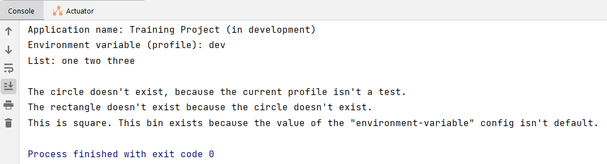
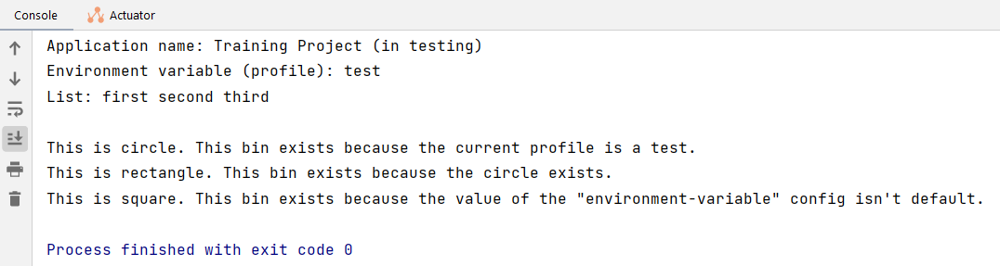
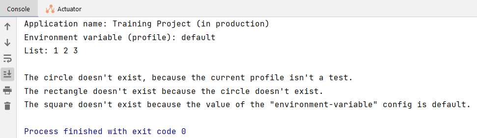
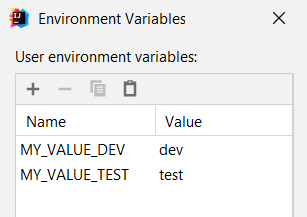

# Homework-4
1) Создать 3 профиля - dev, test, prod, каждый из которых будет включать в себя:
    1.1) конфиг с листом из нескольких значений
    1.2) название приложения
    1.3) конфиг с переменной окружения, по дефолту значение - default
2) 3 бина:
    2.1) один создается, только если профиль test,
    2.3) другой, если существует первый бин,
    2.3) третий, если в конфиге с не “default” (тут в идеале со скриншотом)

## Решение
Целевое приложение - `training-project`.

Вывод в консоль при смене профилей:
* dev:

* test:

* prod:

### Ремарка
Для профиля `prod` значение переменной окружения не задано, следовательно, в конфигурационном файле `application-prod.properties` параметр `some.test.environment-variable` будет содержать значение по умолчанию `default`:

