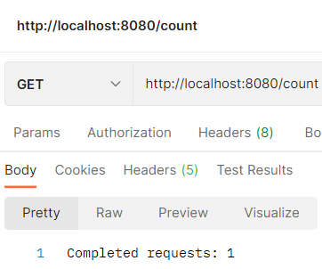
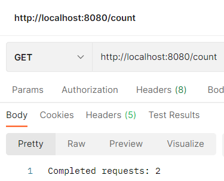

# Homework-9
Реализовать с помощью АОП приложение, которое будет считать количество обращений к АПИ методам и если количество обращений достигнет максимального (максимальное количество обращений задается в конфигурации), то не допускать выполнения АПИ метода.
## Решение
Целевое приложение - `AOP`.

Пусть максимальное количество обращений равно 5. Выполняем GET-запросы по адресу `http://localhost:8080/count`:

и т. д.

После попытки выполнения 6-го запроса API-метод не выполнится, и ничего выведено не будет.
