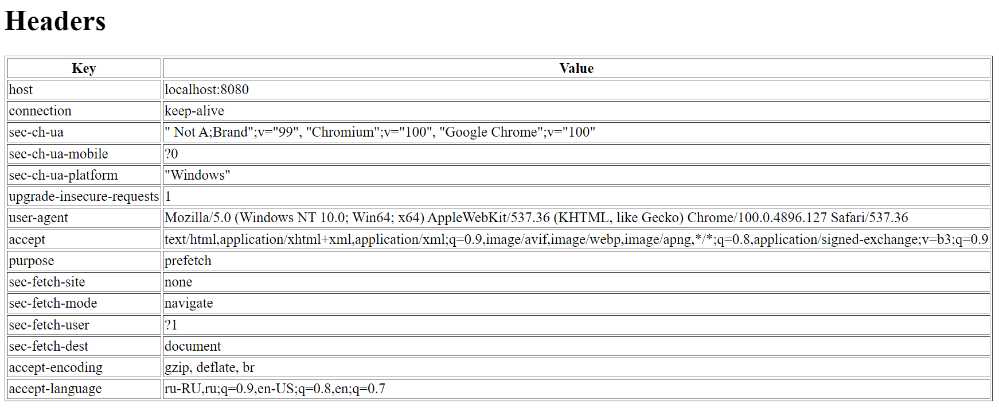

# Homework-6
1) Реализовать два контроллера. Один контроллер должен в качестве ответа на GET запрос отдавать шаблон, в котором выводится список всех заголовков запроса. Второй контроллер должен принимать на вход JSON вида:
```json
{
    "price": 125.0,
    "info": {
        "date": "2022-01-01"
    }
}
```
и отдавать его обратно, при этом добавив в ответ свойство id:
```json
{
    "price": 125.0,
    "info": {
        "id": 123,
        "date": "2022-01-01"
    }
}
```
2) Написать обработчик ошибок, который будет возвращать кастомную 502 ошибку (@ControllerAdvice вам в помощь)

## Решение
Целевой проект - `http`.

1. Вывод списка всех заголовков GET-запроса:




2. Результат работы POST-запроса с обновлённым JSON:


3. Вывод кастомной ошибки 502 Bad Gateway:


