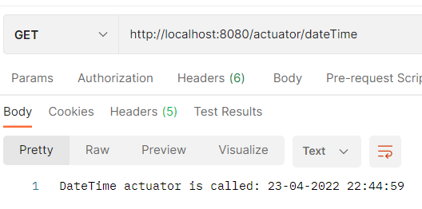

# Homework-11
1) Создать (можно использовать существующее из предыдущих заданий) веб приложение которое бы отдавало следующие метрики:
* количество запросов 
* время выполнения запроса
2) Создать свою метрику. Например количество пользователей онлайн. Можно сделать счетчик который увеличивается через определенный интервал и его результат отдавать в метриках приложения
3) Создать свой актуатор. Например, при вызове которого в лог выводилось сообщение с датой и временем вызова актуатора
## Решение
Целевое приложение - `AOP`. Был использован проект из ДЗ 9 (по аспектам).

Метрики по методу `IncAndGetRequestsCount` класса `UserService` в Prometheus.
* количество вызовов:

* максимальное время выполнения:

Метрика о количестве посещений веб-страницы (увеличивается на 1 каждые 3 секунды):

Выполнение `ReadOperation` пользовательской конечной точки `DateTime` актуатора:

