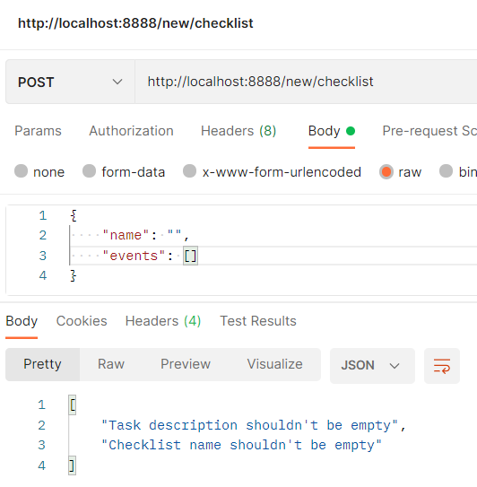

# Homework 7
а) создать контроллер, в котором:
endpoint, который на вход будет принимать данные в виде:
```
{
    "name": "Мой список дел",
    "events": ["дело1", "delo2", "delo3"]
}
```
валидировать их и сохранять в базу
endpoint, который будет отдавать данные из бд в виде:
```
[
      {
        "name": "Мой список дел",
        "events": ["дело1", "delo2", "delo3"]
    },
    {
        "name": "Мой список дел2",
        "events": ["дело1", "delo2", "delo3"]
    }
]
```
б) спроектировать структуру БД для этих данных. В качестве БД можно взять любую БД

## Решение
Целевой проект - `demo`.
Используемая СУБД - `PostgreSQL`.

БД должна хранить все списки дел и привязанные к ним задачи. Следовательно, на этапе проектирования структура БД может выглядеть следующим образом:


Добавим 2 новых списка дел в БД:


Если попытаемся добавить список дел со слишком длинным названием, получим понятную для пользователя ошибку:


Также ошибки валидации возникают, если оставить имя или список задач пустым:



Можем просмотреть все списки, сохранённые в БД:


Также дополнительно имеется возможность удалять ненужные списки по их названию:


